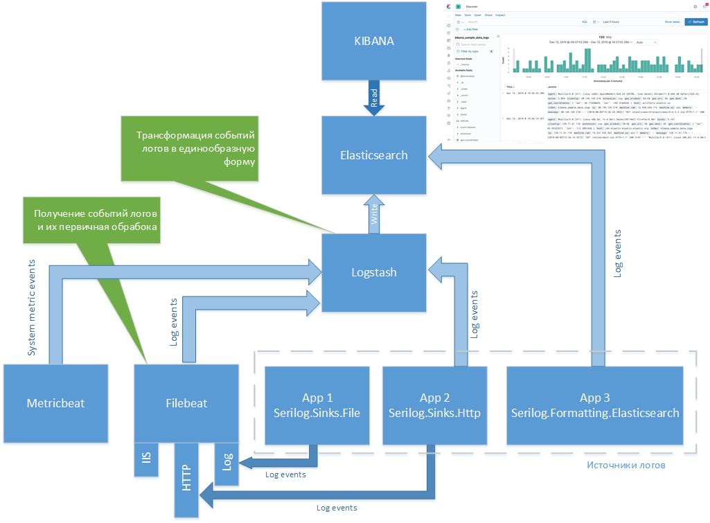
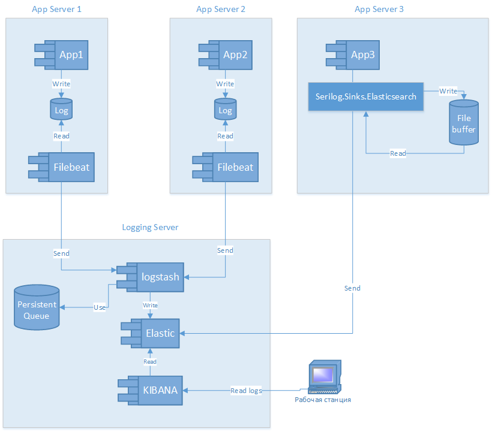

# ELK

Основные коппоенты
* [Elasticsearch](elastic.md)
* [Logstash](logstash.md)
* [Kibana](kibana.md)

> Версии должны быть одинаковые

Дополнительные
* [Serilog](serilog.md)
* [Filebeat](filebeat.md)

Инструменты
Для удобства отсылки HTTP-запросов вручную будем использовать ```Visual Studio Code``` и расширение ```REST Client```
Для нагрузочного тестирования aps.net core приложения можно воспользоваться [```ab.exe```](https://drupal.ru/node/3993) из папки tools

Примеры находятся в папке ```src```

## Картина в целом

Общая схема


Схема размещения


## Сравнение разных вариантов (Seriog)

### Пример ```TestSerilogSinks```

В примере генерировалось до 100 000 событий в лог с задержкой 10 мс.

1. Запись логов в файл (через async wrapper) -> filebeat -> logstash -> elastic
2. Отсылка логов в Elastic
3. Отсылка логов в Logstash -> elastic

При непосредственной записи логов в файл - события в файле появляются быстро, перед завершением программы flush/dispose выполняются быстро. Доставка в Logstash через Filebeat, а уже затем в elastic: в записи (elastic) добавляются служебные поля, имя файла логов, название beat-а, дата-время записи - это уже дата-время на logstash обработки лога, т.е. не совпадает с непосредственным событием в логе и требуется дополнительная трансформация средствами фильтров logstash. Сами записи в elastic появляются очень не сразу.

При отсылки событий логирования сразу в elastic. Необходимо учитывать фактор надёжности и при необходимости включать предварительный сброс событий на диск в файлы или смириться с возможной потерей некоторых событий. События в elastic появляются не моментально, при очень большом потоке событий перед завершением программы flush/dispose выполняются очень медленно. При крахе приложения и последующем перезапуске - события из дисковой очереди - постепенно досылаются в elastic.

При отсылке событий в elastic через logstash. Необходимо учитывать фактор надёжности и при необходимости включать предварительный сброс событий на диск в файлы или смириться с возможной потерей некоторых событий. События в elastic появляются через некоторое время (иногда продолжительное), при очень большом потоке событий перед завершением программы flush/dispose выполняются медленно, но побыстрее чем при использовании варианта отсылки сазу в elastic. При крахе приложения и последующем перезапуске - события из дисковой очереди - постепенно досылаются в elastic. Т.к. события попадают в elastic через logstash - то logstash дополняет их своими служебными полями и дата-время записи - это уже дата-время на logstash обработки лога, т.е. не совпадает с непосредственным событием в логе и требуется дополнительная трансформация средствами фильтров logstash.

>При генерировалось до 100 000 событий в лог без задержки.
Логироваие в файл справилось без проблем.
Логирование непосредственно в elastic - очень долго выполнялся flush/dispose
Логирование в elastic через logstash - flush/dispose выполнялся долго, но гораздо быстрее, чем непосредственное использование elastic, события в elastic появлялись с большой задержкой.

Во всех примерах ни одно событие логирования не было потеряно.


#### При тестировании asp.net core приложения ```TestSerilogWebAppNetCore``` нагрузка создавалась так:

```powershell
.\ab.exe -n 1000 -c 10 http://localhost:5000/api/values/100
```
т.е. выполнить 1000 запросов (причём одновременно по 10), каждый запрос генерирует в лог вывод примерно 100 записей с задержкой 10 мс. Ни одно событие лога не потерялось, все были доставлены ва elastic как напрямую, так и через logstash + http beat.

#### Далее
Для сквозного поиска по событиям логов в KIBANA - имеет смысл создать KIBANA-index на логи от всех приложений сразу. Например:
* App1 - индекс в elastic: ```retail-app1-YYYY-MM-DD```
* App2 - индекс в elastic: ```retail-app2-YYYY-MM-DD```
* App3 - индекс в elastic: ```retail-app3-YYYY-MM-DD```

Тогда общий шаблон KIBANA-индекса будет ```retail-*```, что даст возможность поиска сразу по логам всех трёх приложений. И смотреть что происходило в них в одно и тоже время. Если како-либо прикладное событие начинается в одном приложении и далее проходит по всем остальным, то имеет смысл завести сквозной trace-id и фильтровать события логов по нему. Это уже тема [zipkin](https://zipkin.io/)