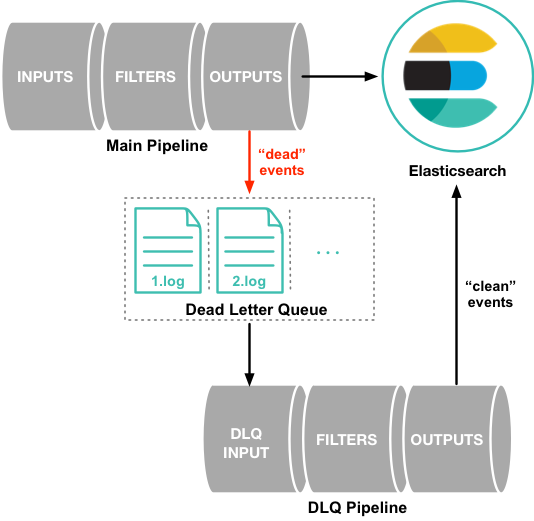

## Logstash
Logstash - это конвейер обработки данных на стороне сервера, который принимает данные из нескольких источников одновременно, преобразует их и затем отправляет в «хранилище», например Elasticsearch.

Возможности
* Получить данные из разных источников (input)
* Трансформировать и дополнить их
* Положить данные в разные "хранилища" (output)

Устройство
* Обработчики входныех потоков (input)
* Обработчики выходныех потоков (output)
* Фильтры (filter)
* Плагины
* Трансформация данных
* Очереди

Logstash получает данные (события) из источников (inputs), кладёт их в очередь, затем обрабатывает и отсылает в outputs.

```
input → queue → filter + output
```

Поумолчанию очередь - в памяти. Но для надёжности очередь может быть организована на [диске](https://www.elastic.co/guide/en/logstash/7.6/persistent-queues.html)
При использовании очереди на диске - вводится механизм checkpoint-ов, всё что за checkpoint - гарантируется для доставки в output, что до checkpoint - не гарантируется. Поумолчание кол-во событий, при котором происходит checkpoint равно 1024, следоватьельно при сбое может потеряться некоторое число событий.

После перезапуска logstash - происходит попытка доставить события из очереди.

inputs - принимают события, далее события помещаются в очередь, но если очередь не может принять событие, то оно отбросится. Если input HTTP, то вернётся 409 и контрагент должен попробовать отослать ещё раз через некоторе время. Если input - tcp, то нет механизма подтвержения успеха принятия данных и соответсвенно гарандий доставки output.

В output - отсылаются события.  Если это elastic, то может быть ошибка маппинга данных, если изначально поле события было одного типа, а в другой раз - другого типа, такое событие не может быть записано в elastic. Elastic возвращает 409 (conflict). Такое событие не обрабатывается повторно. В output события могун отсылаться не по одному, а пачками. Если не получается отослать событие в output. то происходит повтор (но такое поведение не для всех случаем ошибок, пример elastic возвращет 409 (conflict)).


>Все события, в доставке которых происошла ошибка записываются в ёщё одну очередь (её нужно включить): [dead letter queue](https://www.elastic.co/guide/en/logstash/7.6/dead-letter-queues.html) и их впоследствии можно попытаться куда-либо доставить. Для этого используется input [Dead_letter_queue](https://www.elastic.co/guide/en/logstash/7.6/plugins-inputs-dead_letter_queue.html)




Итого: есть input-ы, output-ы которые имеют много своих настроек. Есть внутренние очереди logstash со своими настройками. Есть различные фильтры. Получается, что после появления события в логе на исходной машине и до того как оно попадёт в хранилище или хранилища логов - может пройти довольно много времени, например минуты. Процесс этот носит сильно асинхронный характер.


### **Установка и запуск** (Windows + PowerShell)
* [Скачать дистрибутив (zip-архив)](https://www.elastic.co/downloads/logstash)
* Распакавать архив
* Перейти в папку с архивов
* Требуется Java
* Лучше запускать logstash под Администратором
* Проверка

```powershell
java -version
```

* Проверка установлена ли переменная окружениея JAVA_HOME
```powershell
$env:JAVA_HOME
```
* Если JAVA_HOME не задана, то установить её
```powershell
$env:JAVA_HOME="path to java folder"
```
* Тестовый запуск - читает данные с консоли (клавиатуры) и выводит в консоль
```powershell
.\bin\logstash.bat -e 'input { stdin { } } output { stdout {} }'
```
Подождать, затем печатать символы, CTRL+C - завершить

* Создать файл конфига ```first-pipeline.conf``` в папке ```config```

Пример 1: слушаем порт 31311 на входящие http-запросы и выводим их в elastic

```yaml
input {
  http {
    host => "127.0.0.1"
    port => 31311
  }
}

filter {
}

output {
  elasticsearch {
    hosts => ["http://localhost:9200"]
    index => "app-logstash-%{+YYYY.MM.dd}"
  }
}

```
Используется [http-input](https://www.elastic.co/guide/en/logstash/7.6/plugins-inputs-http.html) и [elastic-output](https://www.elastic.co/guide/en/logstash/7.6/plugins-outputs-elasticsearch.html)

* Запуск для проверки конфига
```powershell
.\bin\logstash.bat -f .\config\first-pipeline.conf --config.test_and_exit
```

* Запуск с мониторингом изменений в конфиге
```powershell
.\bin\logstash.bat -f .\config\first-pipeline.conf --config.reload.automatic
```


Пример 2: используем filebeat - слушаем порт 5044 и выводим их в elastic

```yaml
input {
  beats {
    port => 5044
  }
}

filter {
  mutate {
    rename => { "json[Host]" => "json[MyHost]" }
    remove_field => [ "environment", "[fields][review]" ]
  }
}

output {
  elasticsearch {
    hosts => ["http://localhost:9200"]
    index => "app-logstash-%{+YYYY.MM.dd}"
  }
}

```
Используется [filebeat-input](https://www.elastic.co/guide/en/beats/filebeat/7.6/filebeat-getting-started.html) и [elastic-output](https://www.elastic.co/guide/en/logstash/7.6/plugins-outputs-elasticsearch.html). Трансформация [mutate-filter](https://www.elastic.co/guide/en/logstash/7.6/plugins-filters-mutate.html)


Примечание

>Filebeat is one of the best log file shippers out there today — it’s lightweight, supports SSL and TLS encryption, supports back pressure with a good built-in recovery mechanism, and is extremely reliable. It cannot, however, in most cases, turn your logs into easy-to-analyze structured log messages using filters for log enhancements. That’s the role played by Logstash.

Полезные ссылки
* https://www.elastic.co/guide/en/logstash/current/introduction.html
* https://www.elastic.co/guide/en/logstash/current/getting-started-with-logstash.html
* https://www.elastic.co/blog/introducing-logstash-input-http-plugin
* https://www.elastic.co/guide/en/logstash/7.6/dead-letter-queues.html

Полезные команды

